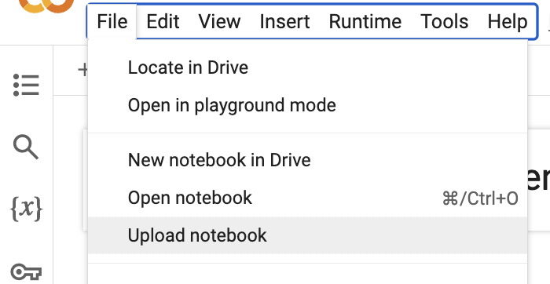
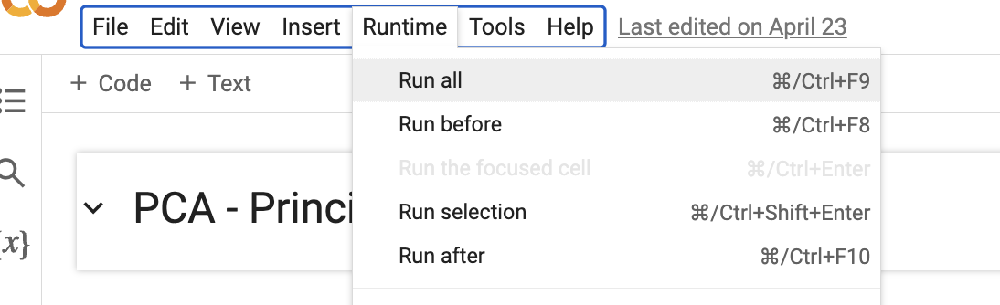
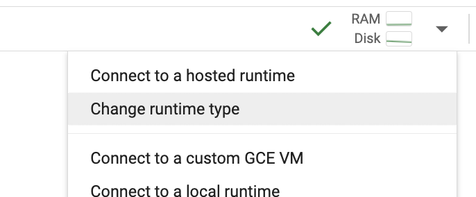

<table>
<tr>
<td>
<a href= "https://www.brastel.com/pages/por/home/"></a>
</td>
<td><a href= "https://www.inteli.edu.br/"></a>
</td>
</tr>
</table>

# Projeto: Sistema de processamento de linguagem natural com IA generativa

# Grupo: Kotodama

# Integrantes:
* [Mateus Almeida](Mateus.Almeida@sou.inteli.edu.br)
* [Raphael Antunes](Raphael.Antunes@sou.inteli.edu.br)
* [Renato Machado](Renato.Machado@sou.inteli.edu.br)
* [Sergio Lucas](Sergio.Lucas@sou.inteli.edu.br)
* [Stefano Butori](Stefano.Butori@sou.inteli.edu.br)
* [Thomas Barton](Thomas.Barton@sou.inteli.edu.br)
* [Vitor Barros](Vitor.Barros@sou.inteli.edu.br)

# Descrição
A crescente demanda no Serviço de Atendimento ao Cliente da Brastel tem superado a capacidade de resposta dos atendentes, resultando em desafios para atender de maneira eficiente os clientes da empresa. Para enfrentar esse problema, propõe-se a implementação de um chatbot baseado em inteligência artificial generativa, integrado a uma aplicação web. Essa solução permitirá que os clientes consigam tirar suas dúvidas de forma rápida e eficiente, aliviando o atendimento resolvido por funcionários da Brastel, resultando numa melhora na experiência de atendimento do usuário e no aumento da base de clientes da empresa. A aplicação, além de atender os clientes, permitirá que a equipe de atendimento gerencie e publique novas instruções, controle o versionamento, defina qual modelo de linguagem natural (LLM) utilizar e gerencie o controle de acessos dos diversos chats. O desenvolvimento do chatbot envolveu um processo criterioso que abrange a coleta e preparação de dados relevantes, o treinamento e ajuste fino do LLM, e a integração deste modelo à aplicação. Uma parte essencial desse processo é o desenvolvimento de um modelo de classificação de intenção, que foi utilizado para identificar as intenções dos usuários e orientar o LLM na geração de respostas mais precisas e contextualmente adequadas.

# Configuração para desenvolvimento

## Notebooks
### Uso no Google Colab
O projeto foi desenvolvido através da plataforma Google Colab. Para utilizar a última versão do modelo desenvolvido pelo grupo nesta plataforma, siga os seguintes passos:

1. Faça o Download dos arquivos dentro da pasta '/notebooks/sprint 5' (caso o arquivo não esteja na raiz dessa pasta, verifique se está em uma das subpastas utilizando a função de pesquisa do GitHub).
2. Crie uma Conta no [Google Colab](https://colab.research.google.com/), caso não tenha.
3. Na plataforma Colab, faça upload dos notebooks indo na opção File > Upload Notebook



4. Seleciona a opção Runtime > Run All e siga as demais instruções contidas no Notebook



5. Pronto, agora é possível treinar os modelos de classificação e LLM. Caso queira, é possível alternar a GPU utilizada na plataforma Colab, para que o processo de treinamento ocorra mais rápido.



### Uso local
Caso queira utilizar localmente siga os seguintes passos:

1. Instale o [python 3.12](https://www.python.org/downloads/)
2. Abra um terminal na pasta ['/notebooks'](https://github.com/Inteli-College/2024-2A-T01-CC11-G02/tree/main/notebooks) e execute o comando ```pip install jupyter notebook```
3. Execute ```pip install -r requirements.txt``` para instalar todas as dependências necessárias.
4. Pronto. Agora é só executar os notebooks.

## Frontend
1. Instale o [node.js](https://nodejs.org/en/download/source-code/current)
2. Abra um terminal na pasta '/app/frontend'
3. Execute ```npm install -g pnpm```
4. Execute ```pnpm i``` para instalar todas as dependências necessárias.
5. Execute ```pnpm dev``` para iniciar a aplicação.
6. Pronto. A aplicação está disponível em http:127.0.0.1:3000/

## Backend
1. Instale o [python 3.12](https://www.python.org/downloads/) se ainda não foi instalado.
2. Abra um terminal na pasta '/app/backend'
3. Execute ```pip install -r requirements.txt``` para instalar todas as dependências necessárias.
4. Execute ```python app.py``` para iniciar a aplicação.
5. Pronto. A aplicação está disponível em http:127.0.0.1:5000/

# Tags
- [SPRINT 1](https://github.com/Inteli-College/2024-2A-T01-CC11-G02/releases/tag/SPRINT1)
  - Pipeline de Processamento e Base de Dados
  - Draft do Artigo
  - Apresentação da SPRINT 1
- [SPRINT 2](https://github.com/Inteli-College/2024-2A-T01-CC11-G02/releases/tag/SPRINT2)
  - Implementação de Modelo Baseline (BoW com NB)
  - Implementação de Modelo com Rede Neural e Word2Vec pré-treinado
  - Artigo com Avaliação Inicial de Modelos de Classificação de Texto
  - Apresentação da SPRINT 2 
- [SPRINT 3](https://github.com/Inteli-College/2024-2A-T01-CC11-G02/releases/tag/SPRINT3)
  - Implementação de Modelo LSTM ou RNN
  - Artigo com Avaliação de Modelo LSTM ou RNN
  - Apresentação da SPRINT 3 
- [SPRINT 4](https://github.com/Inteli-College/2024-2A-T01-CC11-G02/releases/tag/SPRINT4)
  - Implementação de Modelo LLM ou BERT
  - Artigo com Avaliação de Modelo LLM ou BERT
  - Apresentação da SPRINT 4
- [SPRINT 5](https://github.com/Inteli-College/2024-2A-T01-CC11-G02/releases/tag/SPRINT5)
  - Implementação Final
  - Implementação de desafio (RAG)
  - Artigo Final
  - Apresentação Final 
   
# Licença

<br>


[Application 4.0 International](https://creativecommons.org/licenses/by/4.0/?ref=chooser-v1)

