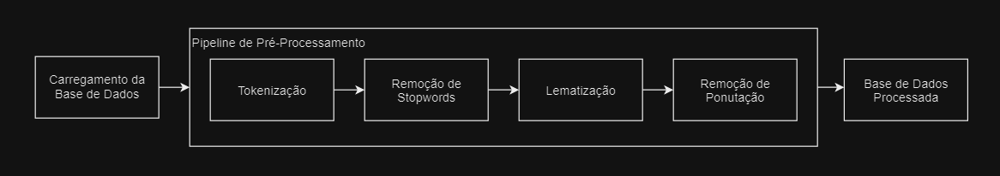
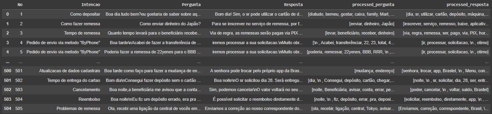
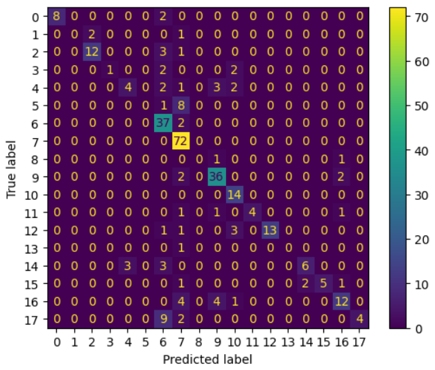
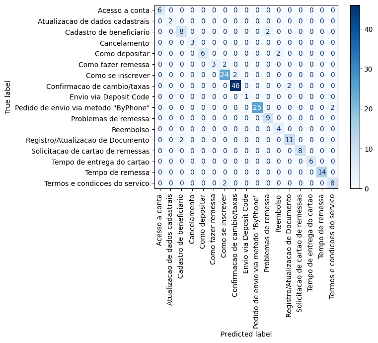
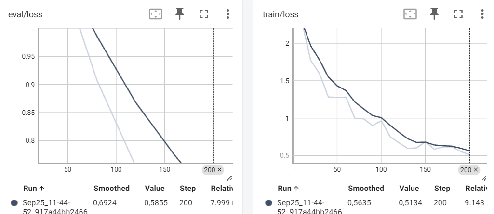
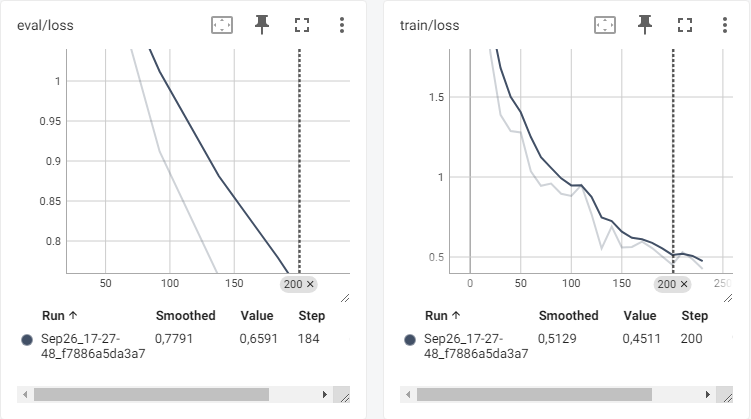
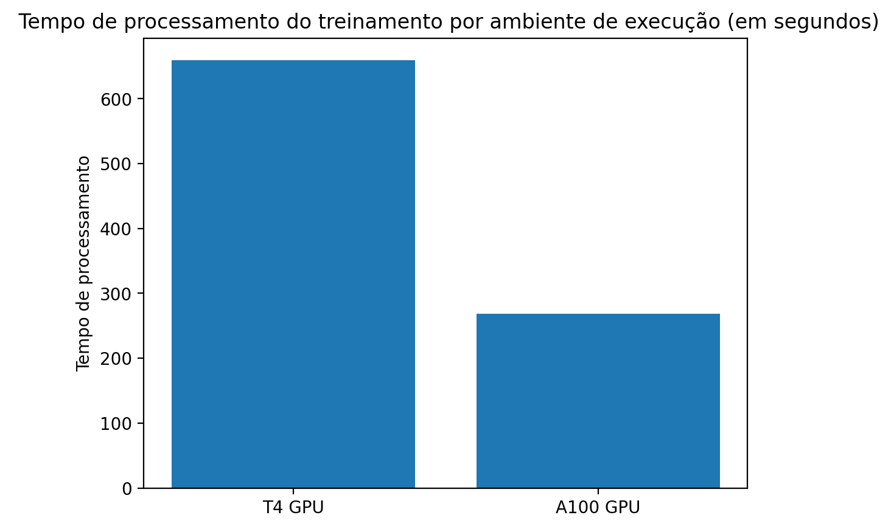
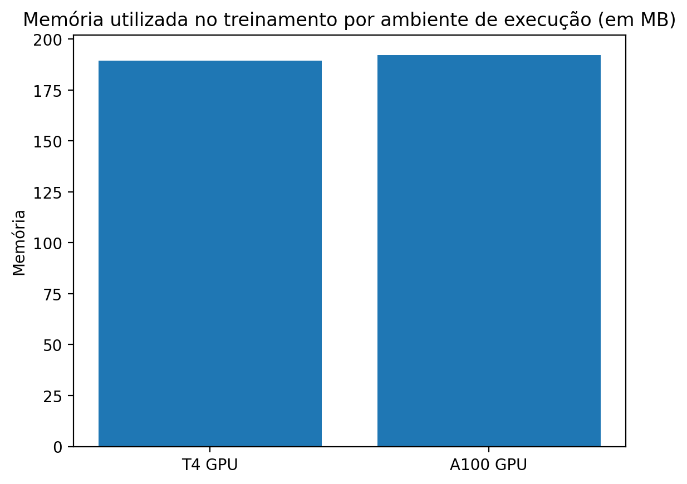

# Introdução

Fundada em 1996 em Tóquio, a Brastel Co., Ltd. destaca-se por oferecer serviços financeiros e de telecomunicações para estrangeiros residentes no Japão, incluindo cartões telefônicos e serviços de voz por IP.

A crescente demanda no Serviço de Atendimento ao Cliente (SAC) tem superado a capacidade dos atendentes, dificultando um atendimento eficiente. Para resolver esse desafio, propomos a implementação de um chatbot baseado em inteligência artificial generativa, integrado a uma aplicação web. Essa solução permitirá que os clientes tirem suas dúvidas de forma rápida, aliviando a carga dos atendentes e melhorando a experiência do usuário, o que pode aumentar a base de clientes.

Além de atender os clientes, a aplicação permitirá que a equipe gerencie e publique novas instruções, controle o versionamento, defina o modelo de linguagem natural (LLM) a ser utilizado e gerencie o acesso aos diversos chats. O desenvolvimento envolve a coleta e preparação de dados relevantes, o treinamento e ajuste fino do LLM e sua integração à aplicação. Um componente essencial é o modelo de classificação de intenção, que identificará as intenções dos usuários para gerar respostas mais precisas e contextualmente adequadas.

Este projeto alinha-se com as metas estabelecidas no TAPI, incluindo criar uma solução para a alta demanda no SAC, melhorar a satisfação dos clientes e aumentar a base de clientes. Com o objetivo de atender mais de 25 mil atendimentos mensais via chat online e suportar uma operação multilíngue, o chatbot visa não apenas aliviar a carga dos atendentes humanos, mas também proporcionar análises contínuas para aprimorar o serviço. Ao final, entregaremos uma solução integrada com um LLM otimizado e um classificador de intenção eficiente, proporcionando um atendimento mais ágil, preciso e escalável para a Brastel, contribuindo significativamente para o crescimento e a satisfação dos usuários da empresa.

# Trabalhos relacionados

Nesta seção, revisamos estudos recentes sobre a aplicação de Modelos de Linguagem de Grande Escala (LLMs) e Inteligência Artificial (IA) Generativa no atendimento ao cliente. Os artigos selecionados exploram diversas abordagens e inovações para melhorar a eficiência, personalização e qualidade do suporte ao cliente, destacando desafios e oportunidades dessa tecnologia emergente.

Utilizamos Google e Google Scholar com termos como "LLM", "ChatBot", "Customer Service", "Generative AI" e "Artificial Intelligence". As buscas mais relevantes foram "LLM Chatbot" e "LLM Customer Service".

1. **Bamberger et al., 2023**

   Este estudo da Boston Consulting Group analisa o impacto atual da IA generativa no atendimento ao cliente, destacando sua implementação em diversas indústrias e benefícios como aumento de produtividade e satisfação do cliente.

   *Pontos Positivos:* Demonstra como a IA generativa pode aumentar a produtividade em até 50%, fornecendo exemplos práticos que evidenciam seu potencial transformador.

   *Pontos Negativos:* Destaca a necessidade de supervisão humana para mitigar erros e vieses, limitando a automação completa. Poderia explorar mais soluções para esses desafios.

2. **Dam, S. K. et al., 2024**

   Apresenta uma revisão abrangente do uso de chatbots baseados em LLMs, abordando aplicações, arquitetura e desafios na implementação em diversos setores.

   *Pontos Positivos:* Oferece análise detalhada das capacidades dos LLMs e sua personalização para diferentes contextos, contribuindo para interações mais eficazes.

   *Pontos Negativos:* Poderia incluir análises práticas das limitações, como mitigação de vieses e necessidade de grandes volumes de dados, enriquecendo a discussão com estudos de caso.

3. **Kolasani, S., 2023**

   Discute otimizações para LLMs visando melhorar o atendimento ao cliente, focando em personalização hiper-relevante e crescimento sustentável das empresas.

   *Pontos Positivos:* Propõe abordagens inovadoras que aumentam a relevância das interações, melhorando satisfação e retenção de clientes, e impulsionando crescimento e receita.

   *Pontos Negativos:* Implementação pode exigir investimentos significativos, não sendo viável para todas as empresas. Poderia discutir trade-offs entre complexidade e benefícios para auxiliar na tomada de decisões.

4. **Shi, J. et al., 2024**

   Apresenta o sistema CHOPS, que utiliza LLMs para interagir com perfis de clientes, oferecendo atendimento personalizado e proativo, antecipando necessidades e melhorando eficiência.

   *Pontos Positivos:* CHOPS representa avanço na personalização, permitindo soluções proativas e reduzindo intervenção humana, aumentando eficiência operacional.

   *Pontos Negativos:* Enfrenta desafios de escalabilidade e integração; o artigo não aprofunda como superá-los. Análises técnicas e estudos de caso poderiam fornecer insights práticos.

5. **Smith et al., 2023**

   Artigo do blog da Databricks sobre como LLMs revolucionam o suporte ao cliente, proporcionando respostas mais rápidas e precisas, e a importância de integrar dados corporativos.

   *Pontos Positivos:* Destaca a capacidade dos LLMs em fornecer respostas precisas e contextuais, melhorando a qualidade do suporte. Integração de dados específicos é estratégica.

   *Pontos Negativos:* Requer estratégia robusta de gerenciamento de conteúdo; o artigo carece de detalhes sobre como desenvolvê-la. Recomendações práticas seriam úteis.

6. **Xiaoliang, M. et al., 2024**

   Descreve o design de um LLM para melhorar o atendimento ao cliente em operadoras de telecomunicações, abordando integração com sistemas existentes e aumento da satisfação.

   *Pontos Positivos:* O LLM pode reduzir tempo de resposta e melhorar satisfação do cliente, integrando-se bem aos sistemas atuais, mostrando alto potencial prático.

   *Pontos Negativos:* Identifica barreiras tecnológicas, como compatibilidade com sistemas legados, sem oferecer estratégias claras para superá-las. Soluções práticas facilitariam a transição.

### Tabela 1: Comparativo entre os trabalhos relacionados

| Estudo               | Ano  | Tecnologia(s) Analisada(s)                       | Observação                                                               |
| -------------------- | ---- | ------------------------------------------------ | ------------------------------------------------------------------------ |
| Bamberger et al.     | 2023 | LLMs e IA Generativa                             | Aumento de produtividade com LLMs e supervisão humana.                   |
| Dam, S. K. et al.    | 2024 | Revisão sobre Chatbots baseados em LLMs          | Discussão sobre capacidades e desafios dos chatbots com LLMs.             |
| Kolasani, S.         | 2023 | Otimização de LLMs para Personalização           | Melhoria na personalização e crescimento sustentável no atendimento.     |
| Shi, J. et al.       | 2024 | Sistema CHOPS com LLMs                           | Atendimento personalizado e proativo utilizando LLMs.                    |
| Smith et al.         | 2023 | LLMs para Suporte ao Cliente                     | Revolução no suporte com integração de dados específicos.                |
| Xiaoliang, M. et al. | 2024 | Design de LLM para suporte ao cliente em Telecom | Melhoria no atendimento em operadoras de telecomunicações.               |

# Materiais e Métodos

Esta seção descreve as etapas realizadas neste trabalho, desde a análise exploratória e o pré-processamento até a implementação dos modelos de NLP, visando possibilitar a reprodução por qualquer leitor com acesso a este artigo.

A base de dados utilizada contém 505 linhas com quatro colunas: id, motivo do contato (intenção), pergunta e respectiva resposta. Foram criadas 11 perguntas (Tabela 2) para entender essa base, respondidas por meio de análise exploratória usando a biblioteca pandas do Python.

### Tabela 2: Perguntas da Análise Exploratória

| Nº | Pergunta                                                                                               | Justificativa                                                                                                                                                     |
|----|--------------------------------------------------------------------------------------------------------|-------------------------------------------------------------------------------------------------------------------------------------------------------------------|
| 1  | Quais são as intenções mais comuns nas interações de chat com os clientes?                             | Identificar as intenções mais comuns para analisar a distribuição dos dados e a necessidade de técnicas de data augmentation.                                      |
| 2  | Existem padrões de comprimento nas perguntas ou respostas que se destacam entre diferentes intenções?   | Compreender se o comprimento das perguntas é uma feature importante para o modelo e se as respostas devem ter um comprimento específico.                           |
| 3  | Quais palavras são mais frequentes nas perguntas e nas respostas?                                       | Analisar o vocabulário comum dos usuários e do sistema para identificar palavras menos relevantes.                                                                |
| 4  | Para cada intenção, quais são as palavras que aparecem unicamente para essa intenção?                  | Identificar palavras exclusivas por intenção para refinar o modelo de classificação, atribuindo maior peso a essas palavras.                                      |
| 5  | Existem palavras que aparecem apenas uma única vez? Se sim, quais são elas?                            | Identificar palavras que podem ser ruído ou outliers para melhorar a limpeza dos dados e a robustez do modelo.                                                    |
| 6  | Qual a média do tamanho das perguntas no geral?                                                        | Auxilia na definição de parâmetros para o modelo e na identificação de outliers.                                                                                  |
| 7  | Qual a média do tamanho das respostas no geral?                                                        | Auxilia no ajuste da geração de respostas, garantindo concisão e informatividade.                                                                                 |
| 8  | Qual a média do tamanho das perguntas por intenção?                                                    | Personaliza a modelagem para diferentes tipos de perguntas, melhorando a precisão e eficiência.                                                                   |
| 9  | Qual a média do tamanho das respostas por intenção?                                                    | Permite ajustar o nível de detalhe das respostas para diferentes intenções.                                                                                       |
| 10 | Qual a relação entre o tamanho das perguntas e das respostas no geral?                                 | Ajuda a calibrar a quantidade de informação fornecida pelo sistema com base no comprimento das perguntas.                                                         |
| 11 | Qual a relação entre o tamanho das perguntas e das respostas por intenção?                             | Auxilia na calibração específica por intenção, podendo melhorar a predição do modelo.                                                                             |

A análise exploratória revelou que a intenção "Confirmação de câmbios/taxas" é a mais frequente, com metade das perguntas concentradas nas três intenções mais comuns, indicando distribuição assimétrica à direita. As perguntas tendem a ser mais curtas (50-100 caracteres), enquanto as respostas variam, chegando a 400 caracteres. Nuvens de palavras mostraram que termos comuns e não relevantes devem ser removidos no pré-processamento. As palavras únicas por intenção destacaram termos específicos que ajudam na categorização. Em média, as perguntas têm 15 palavras e as respostas cerca de 30, sendo mais detalhadas para evitar dúvidas. Não há correlação clara entre o tamanho das perguntas e das respostas, que variam dependendo da intenção.

## Pipeline de Pré-Processamento

A pipeline de pré-processamento é um conjunto de etapas aplicadas aos dados brutos para prepará-los para a modelagem. Inclui tokenização, remoção de stopwords, lematização, entre outras, projetadas para limpar e estruturar os textos (JULURU et al., 2021; EL KAH; ZEROUAL, 2021). A pipeline consiste nas seguintes etapas (Figura 1):


Figura 1: Fluxograma do Pipeline de Pré-Processamento

1. **Carregamento dos Dados**: Dados brutos são carregados de um arquivo CSV.
2. **Tokenização**: Segmentação dos textos em palavras ou subpalavras, com classificação de cada token.
3. **Remoção de Stopwords**: Remoção de palavras comuns sem significado semântico relevante.
4. **Lematização**: Redução das palavras à sua forma base ou lema.
5. **Remoção de Pontuação**: Eliminação de sinais de pontuação dos textos.
6. **Retorno dos Dados**: Dados pré-processados são retornados para uso na modelagem.

Após essas etapas, os resultados obtidos são mostrados na Figura 2:


Figura 2: Resultado do Pipeline de Pré-Processamento

Utilizamos o spaCy, uma biblioteca gratuita e de código aberto para processamento avançado de linguagem natural em Python. A Figura 3 ilustra a transformação dos dados originais após o pré-processamento, mostrando a tokenização, classificação, lematização e remoção de stopwords e pontuações.

```
# 1. Carregamento dos Dados
carregar_arquivo_csv("dados.csv")
frase_exemplo = "Como enviar dinheiro do Japão?"

# 2. Tokenização
tokens = tokenizar(frase_exemplo)
retorno(["Como", "enviar", "dinheiro", "do", "Japão", "?"])

# 3. Remoção de Stopwords
tokens_sem_stopwords = remover_stopwords(tokens)
retorno(["enviar", "dinheiro", "Japão", "?"])

# 4. Lematização
tokens_lematizados = lematizar(tokens_sem_stopwords)
retorno(["enviar", "dinheiro", "Japão", "?"])

# 5. Remoção de Pontuação
tokens_limpos = remover_pontuacao(tokens_lematizados)
retorno(["enviar", "dinheiro", "Japão"])

# 6. Retorno dos Dados
retornar_dados_pre_processados(tokens_limpos)
retorno(["enviar", "dinheiro", "Japão"])
```

Figura 3: Exemplo de execução do Pipeline de Pré-Processamento

## Modelos de Classificação de Intenção

### Métricas de Avaliação

As métricas de avaliação escolhidas foram a matriz de confusão combinada com precisão, acurácia, recall e F1-Score, por fornecerem insights específicos sobre o desempenho do modelo.

- **Matriz de Confusão**: Detalha como as classes estão sendo classificadas, identificando quais classes são mais confundidas entre si (scikit-learn.metrics.confusion_matrix).
- **Acurácia**: Mede a taxa de acerto, dividindo o número de previsões corretas pelo total de previsões (scikit-learn.metrics.accuracy_score).
- **F1-Score**: Equilibra precisão e recall, útil quando há desequilíbrio entre classes ou necessidade de trade-off entre precisão e recall (scikit-learn.metrics.f1_score).

### Comparação de CPU x GPU

Foi avaliado o desempenho dos modelos utilizando CPU e GPU, em termos de tempo de processamento e uso de memória. A comparação foi realizada por meio de experimentos controlados, com múltiplas iterações de treinamento e inferência para obter resultados consistentes.

### Modelo Baseline (Bag of Words com Naive Bayes)

Para o modelo baseline, utilizamos o método Bag of Words (BoW) combinado com o algoritmo Naive Bayes, devido à sua simplicidade e eficácia em tarefas de classificação de texto com conjuntos de dados relativamente pequenos.

**Pipeline do Modelo Baseline**:

- **Pré-processamento**: Aplicação do pipeline descrito anteriormente.
- **Transformação BoW**: Conversão dos textos pré-processados em uma matriz BoW.
- **Treinamento do Naive Bayes**: Uso da matriz BoW para treinar o modelo Naive Bayes.
- **Avaliação Inicial**: Aplicação das métricas de avaliação para avaliar o desempenho.

### Modelo com Rede Neural e Word2Vec Pré-Treinado

A combinação de redes neurais com embeddings pré-treinados como o Word2Vec é eficaz em tarefas de NLP. O Word2Vec transforma palavras em vetores de alta dimensão, capturando relações semânticas, que ao serem integrados em uma rede neural, melhoram a performance em classificação de texto.

**Arquitetura do Modelo**:

- **Embeddings com Word2Vec**: Utilizado modelo pré-treinado do Word2Vec com vetores de 300 dimensões.
- **Camadas da Rede Neural**:
  1. **Input Layer**: Recebe os vetores de palavras do Word2Vec.
  2. **Hidden Layers**: Camadas densas com função de ativação ReLU.
  3. **Output Layer**: Camada densa com função de ativação softmax para classificação multiclasse.

### Modelo com LSTM e Embedding Layer

Implementamos um modelo baseado em LSTM (Long Short-Term Memory) e RNN (Recurrent Neural Network) usando TensorFlow e Keras. As LSTMs foram escolhidas por sua capacidade de mitigar a perda de memória dos inputs iniciais em RNNs tradicionais (GLENN et al., 2023).

**Arquitetura do Modelo**:

- **Embedding Layer**: Input de 5000 dimensões.
- **Camadas LSTM**: Duas camadas LSTM bidirecionais com inputs de 64 e 32 dimensões, respectivamente.
- **Dropout Layer**: 30% para reduzir overfitting.
- **Output Layer**: Função de ativação softmax para classificação multiclasse.

Após a codificação das sequências de texto com o tokenizer do Keras e padronização com `pad_sequences`, os dados foram alimentados na Embedding Layer.

## Data Augmentation

### Aumentação utilizando LLM

Para aumentar a diversidade dos dados, utilizamos um Modelo de Linguagem de Grande Escala (LLM) para gerar novas perguntas dentro de um contexto fornecido por prompts específicos. A metodologia incluiu:

- **Identificação de Dados Relevantes**: Aplicação de redução de dimensionalidade nos embeddings das mensagens e clusterização usando k-vizinhos mais próximos para determinar o valor ideal de "k".
- **Geração de Novas Mensagens**: Seleção de 10 entradas de exemplo enviadas como prompt para o LLM (ChatGPT), que gerou 50 novas mensagens com variação de tamanho, contexto e até erros ortográficos.
- **Aproveitamento da Diversidade**: Aumenta o conjunto de dados com variações significativas na escrita, enriquecendo o treinamento.

Utilizamos também um modelo BERT ("bert-base-portuguese-cased") ajustado para classificação de categorias de atendimento ao cliente, com 19 classes. O modelo foi treinado por 5 épocas com early stopping para evitar overfitting.

## Modelo LLM

### Abordagem adotada

Utilizamos o **Meta-Llama-3.1-8B-Instruct**, com 8 bilhões de parâmetros, equilibrando desempenho e eficiência. Os modelos Llama 3 ajustados por instruções são otimizados para casos de uso de diálogo/chat (META, 2024). Aplicamos a técnica **Low-Rank Adaptation (LoRA)** juntamente com quantização para reduzir o peso do modelo sem comprometer significativamente o desempenho, reduzindo-o para cerca de 88 milhões de parâmetros.

Uma técnica de data augmentation utilizando a biblioteca nlpaug do Python, que usa Word2Vec para substituir palavras por sinônimos, foi aplicada para aumentar as intenções com poucas amostras, e uma análise foi realizada para verificar a eficácia.

### Métricas de Avaliação com Justificativa

A métrica principal foi a **similaridade de cosseno** utilizando BERT para criação de embeddings, por sua capacidade de representar a similaridade de dois textos, onde valores próximos de 1 indicam textos semelhantes. O uso do BERT garante que os embeddings considerem o contexto além das palavras individualmente. A **perda (loss)** também foi utilizada para acompanhar a performance durante o treinamento e validação.

### Comparação de GPUs

As implementações e comparações de desempenho foram feitas utilizando GPUs Nvidia T4 e A100 na plataforma Google Colab. Foram realizadas comparações referentes ao tempo de execução total em segundos e uso de memória RAM em MB.

# Resultados

## Resultado das métricas

### Tabela 3: Resultados comparativos entre os modelos

| Modelo              | Acurácia | f1-score |
| ------------------- | -------- | -------- |
| BoW com Naive Bayes | 75%      | 71%      |
| Word2Vec            | 32%      | 54%      |
| LSTM                | 92%      | 92%      |
| BERT                | 99,5%    | 99,5%    |

A Tabela 3 apresenta os resultados dos modelos de classificação de intenção. O modelo baseline (BoW com Naive Bayes) obteve 75% de acurácia e 71% de f1-score. O modelo com Word2Vec atingiu 32% de acurácia e 54% de f1-score. O modelo LSTM alcançou 92% em ambas as métricas, enquanto o modelo BERT obteve 99,5% em acurácia e f1-score.

Na matriz de confusão do modelo baseline (Figura 4), destacam-se: 72 acertos na classe 7, 36 na classe 9, 37 na classe 6 e nenhuma predição nas classes 1, 5, 8 e 13.


Figura 4: Matriz de confusão do modelo baseline com dados de validação

A matriz de confusão da LSTM (Figura 5) confirma as métricas, apresentando acertos expressivos em todas as categorias.


Figura 5: Matriz de Confusão para Rede Neural LSTM

### Desempenho CPU x GPU

As Tabelas 6 e 7 mostram o tempo de processamento e uso de memória para treinamento e inferência dos modelos.

### Tabela 6: Tempo de processamento para treinamento e inferência dos modelos (em segundos)

| Modelo    | CPU      | T4 GPU   | A100 GPU |
| --------- | -------- | -------- | -------- |
| Baseline  | 0,05635  | 0,07886  | 0,07988  |
| Word2Vec  | 1963,89  | 194,40   | 198,19   |
| LSTM      | ~1800    | ~200     | ~200     |

### Tabela 7: Uso de memória para treinamento e inferência dos modelos (em MB)

| Modelo    | CPU     | T4 GPU  | A100 GPU |
| --------- | ------- | ------- | -------- |
| Baseline  | 0,7324  | 0,7429  | 0,7324   |
| Word2Vec  | 139,65  | 46,70   | 39,94    |
| LSTM      | 46,86   | 44,47   | 2,09     |

Em geral, os modelos com redes neurais apresentaram menor tempo de processamento com o uso de GPU.

## Modelo LLM

### Sem Data Augmentation

Sem data augmentation, a perda de avaliação do modelo LLM diminui até aproximadamente 0,5855 na etapa 200, e a perda de treinamento atinge cerca de 0,5134 (Figura 6).


Figura 6: Gráfico de perda do modelo LLM no treino e validação sem data augmentation

### Com Data Augmentation

Com data augmentation, a perda de avaliação diminui entre 0,6591 e 0,5221 na etapa 200, e a perda de treinamento atinge cerca de 0,4511 (Figura 7).


Figura 7: Gráfico de perda do modelo LLM no treino e validação com data augmentation

### Comparação dos Resultados

### Tabela 8: Comparação LLM com e sem data augmentation

| Modelo                    | Similaridade de cosseno |
| ------------------------- | ----------------------- |
| LLM sem data augmentation | 0,75                    |
| LLM com data augmentation | 0,79                    |

O data augmentation no modelo LLM aumentou a similaridade de cosseno de 0,75 para 0,79.

### Desempenho

O treinamento do modelo LLM na GPU T4 levou 659,85 segundos (~11 minutos), enquanto na GPU A100 foi de 268,94 segundos (~4,5 minutos) (Figura 8). O uso de memória foi similar em ambas as GPUs, cerca de 190 MB (Figura 9).


Figura 8: Gráfico com o tempo de processamento para treinamento do modelo LLM


Figura 9: Gráfico com o uso de memória para treinamento do modelo LLM

# Análise e Discussão

## Modelos de classificação

### Comparação dos Resultados Obtidos entre os Modelos

Foram testados três modelos com desempenhos distintos:

- **Modelo Baseline (Naive Bayes com Bag of Words)**: Obteve 75% de acurácia. Destacou-se pela simplicidade e rapidez, mas teve limitações em capturar relações complexas entre palavras, especialmente em classes com menos exemplos, resultando em variações significativas de precisão e recall entre as categorias.

- **Modelo de Rede Neural com Word2Vec**: Apresentou acurácia de apenas 32%, desempenho inferior ao esperado. Possíveis causas incluem arquitetura não otimizada e desbalanceamento do dataset, dificultando o aprendizado das diferentes classes. O treinamento foi mais custoso em tempo e recursos computacionais.

- **Modelo LSTM com Embedding Layer**: Alcançou a melhor acurácia, com 92%. A LSTM capturou dependências de longo prazo em sequências de texto, e a camada de embedding treinada gerou representações densas de palavras. Houve baixa variância entre os conjuntos de treino e validação, indicando bom ajuste sem overfitting. A capacidade da LSTM em capturar dependências temporais e contextuais foi crucial para o desempenho superior.

A utilização de técnicas de data augmentation beneficiou o fine-tuning do modelo BERT, reduzindo o viés para classes majoritárias e aumentando a robustez frente ao desbalanceamento de categorias.

### Análise sobre o treinamento com GPU e CPU

No treinamento do modelo baseline, a **CPU** teve o menor tempo de execução, pois o scikit-learn não está otimizado para GPUs, que introduzem overhead na transferência de dados.

Para redes neurais, as **GPUs**, especialmente a A100, foram muito eficientes, reduzindo o tempo de treinamento em mais de 10 vezes comparado à CPU e consumindo menos memória, graças ao alto paralelismo e otimizações para deep learning.

A comparação evidencia que, enquanto a CPU é mais rápida para modelos não otimizados para GPU, as redes neurais se beneficiam enormemente do uso de GPUs.

### Comparação com modelos presentes na literatura

- **Minaee et al. (2020)**: Modelos de deep learning superam abordagens clássicas em classificação de texto. O modelo LSTM deste estudo, com acurácia de 92%, confirma essa conclusão.

- **Kalchbrenner et al. (2020)** e **Kim (2014)**: Destacam os benefícios de CNNs e RNNs combinadas com embeddings como Word2Vec. Embora tenha sido usada uma arquitetura mais simples, os resultados foram comparáveis.

- **Kolluri et al. (2019)**: Afirmam que deep learning supera modelos tradicionais, especialmente em dados complexos. Nossos resultados corroboram parcialmente, mas o desbalanceamento de classes afetou o desempenho.

- **Gupta et al. (2023)**: LSTM com GloVe alcança alta acurácia apesar do desbalanceamento. A acurácia da LSTM no presente estudo está alinhada com esses achados.

- **Hasib et al. (2023)**: Propõem um modelo MCNN-LSTM eficaz para dados desbalanceados. Os resultados do nosso modelo LSTM são consistentes com a eficácia de redes neurais nesse contexto.

**Tabela 9: Comparação dos resultados com a literatura**

Autor | Modelo | Principais Resultados | Comparação
--- | --- | --- | ---
Minaee et al. (2020) | Word2Vec + CNN | Deep learning melhora acurácia e generalização. | O modelo atual confirma essa conclusão.
Kalchbrenner et al. (2020) | CNNs e RNNs com Word2Vec | Excelentes resultados com ajuste fino. | Resultados comparáveis, mesmo com arquitetura mais simples.
Kolluri et al. (2019) | Deep learning vs. tradicionais | Deep learning é superior em dados complexos. | Conclusões parcialmente corroboradas; desbalanceamento afetou o desempenho.
Gupta et al. (2023) | GloVe com LSTM | Alta acurácia apesar do desbalanceamento. | Acurácia da LSTM está de acordo com o esperado.
Hasib et al. (2023) | MCNN-LSTM | Eficaz para dados desbalanceados. | Resultados consistentes com a eficácia de redes neurais.

## Modelo Meta Llama 3.1

### Aplicação na geração de respostas

O **Meta Llama 3.1** foi utilizado para gerar respostas coerentes e adequadas. Após reduzir os parâmetros de 8 bilhões para 88 milhões com a técnica Lora, o modelo manteve boa performance. O tempo de treinamento foi de 2,5 minutos por época na GPU A100 e 4,5 minutos na GPU T4.

### Alternativas de treinamento com CPU e GPU

Treinar o Meta Llama 3.1 requer alta capacidade computacional. Sem a redução de parâmetros, o treinamento era inviável, mesmo com GPUs. Com a redução, as **GPUs T4 e A100** foram significativamente mais eficientes que a CPU, reduzindo o tempo de processamento. O treinamento total levou 11 minutos na A100 e 25 minutos na T4, com desempenho semelhante na qualidade das respostas geradas.

# Conclusão

Este estudo enfatiza a importância de escolher o modelo e o ambiente de treinamento adequados. O BERT com fine-tuning e data augmentation mostrou-se eficaz na classificação de intenções no chatbot. O uso de GPU é recomendado para otimizar o tempo de treinamento em redes neurais complexas.

Na geração de respostas, o GPT-2 foi descartado pela baixa performance. O Meta Llama 3.1, com a configuração LoRA que reduz os parâmetros de 8 bilhões para 88 milhões, demonstrou desempenho superior e foi escolhido como modelo principal. O Llama-3.2 apresentou resultados promissores, mas requer análises adicionais.

A seleção criteriosa entre modelos como LSTM, BERT e Meta Llama, aliada ao uso de GPUs, é essencial para soluções robustas em compreensão e geração de linguagem natural. Futuros estudos podem explorar a otimização de hiperparâmetros, novas técnicas de data augmentation e o uso do LLama-3.2.

A implementação do chatbot com esses modelos permitirá à Brastel atender mais de 25 mil atendimentos mensais via chat online, suportando uma operação multilíngue e proporcionando um atendimento mais ágil e escalável. A redução da carga de trabalho dos atendentes otimizará os recursos internos. Espera-se melhorar a experiência do cliente e aumentar a satisfação e a base de usuários.

# Referências Bibliográficas

BAMBERGER et al. "How Generative AI Is Already Transforming Customer Service." Boston Consulting Group, 2023. Disponível em: <https://web-assets-pdf.bcg.com/prod/how-generative-ai-transforms-customer-service.pdf>. Acesso em: 26 set. 2024.

DAM, S. K. et al. "A Complete Survey on LLM-based AI Chatbots." arXiv, 2024. Disponível em: <https://arxiv.org/pdf/2406.16937>. Acesso em: 26 set. 2024.

DEVLIN, J. et al. BERT: Pre-training of Deep Bidirectional Transformers for Language Understanding. Disponível em: <https://arxiv.org/abs/1810.04805>. Acesso em: 26 set. 2024.

EL KAH, A.; ZEROUAL, I. The effects of Pre-Processing Techniques on Arabic Text Classification . **Int. J**, v. 10, n. 1, p. 1–12, 2021. Disponível em: <https://www.academia.edu/download/65735811/ijatcse061012021.pdf>. Acesso em: 26 set. 2024.

SCIKIT-LEARN DEVELOPERS. Frequently Asked Questions. Disponível em: [https://scikit-learn.org/stable/faq.html#will-you-add-gpu-support](https://scikit-learn.org/stable/faq.html#will-you-add-gpu-support). Acesso em: 11 set. 2024.

GLENN, A.; LACASSE, P.; COX, B. Emotion classification of Indonesian Tweets using Bidirectional LSTM. Neural Computing and Applications, 6 fev. 2023. Disponível em: <https://link.springer.com/content/pdf/10.1007/s00521-022-08186-1.pdf>. Acesso em: 26 set. 2024.

GOOGLE. google-bert/bert-base-uncased - Hugging Face. Disponível em: <https://huggingface.co/google-bert/bert-base-uncased>.

Frequently Asked Questions. Disponível em: [https://scikit-learn.org/stable/faq.html#will-you-add-gpu-support](https://scikit-learn.org/stable/faq.html#will-you-add-gpu-support). Acesso em: 11 set. 2024.

JOSHUA, S. et al. A detailed review on word embedding techniques with emphasis on word2vec. Multimedia Tools and Applications, 3 out. 2023. Disponível em: https://link.springer.com/article/10.1007/s11042-023-17007-z

JULURU, K. et al. Bag-of-words technique in natural language processing: a primer for radiologists. **RadioGraphics**, v. 41, n. 5, p. 1420–1426, 2021. Disponível em: <https://pubs.rsna.org/doi/pdf/10.1148/rg.2021210025>. Acesso em: 26 set. 2024.

KHUNTIA, M.; GUPTA, D. Indian News Headlines Classification using Word Embedding Techniques and LSTM Model. Procedia Computer Science, v. 218, p. 899–907, 2023. Disponível em: https://www.sciencedirect.com/science/article/pii/S1877050923000704

K. M. HASIB et al., MCNN-LSTM: Combining CNN and LSTM to Classify Multi-Class Text in Imbalanced News Data. IEEE Access, vol. 11, pp. 93048-93063, 2023. Disponível em: https://ieeexplore.ieee.org/abstract/document/10233873

KOLANASI, S. "Optimizing Natural Language Processing, Large Language Models (LLMs) for Efficient Customer Service, and Hyper-personalization to Enable Sustainable Growth and Revenue." Transactions on Latest Trends in Artificial Intelligence, 2023. Disponível em: <https://ijsdcs.com/index.php/TLAI/article/download/476/196>. Acesso em: 26 set. 2024.

LI, L. et al. Text sentiment analysis of film reviews using Word2Vec-LSTM. In Third International Conference on Electronic Information Engineering, Big Data, and Computer Technology (EIBDCT 2024) (Vol. 13181, pp. 182-187). SPIE. Disponível em: https://www.spiedigitallibrary.org/conference-proceedings-of-spie/13181/131810T/Text-sentiment-analysis-of-film-reviews-using-Word2Vec-LSTM/10.1117/12.3031046.short

LI, S. Multi Class Text Classification With Deep Learning Using BERT. Disponível em: <https://towardsdatascience.com/multi-class-text-classification-with-deep-learning-using-bert-b59ca2f5c613>

MALLIK, A.; KUMAR, S. Word2Vec and LSTM based deep learning technique for context-free fake news detection. Multimedia Tools and Applications, v. 83, n. 1, p. 919–940, 29 maio 2023. Disponível em: https://link.springer.com/article/10.1007/s11042-023-15364-3

MUREL, J.; KAVLAKOGLU, E. What is bag of words? Disponível em: [https://www.ibm.com/topics/bag-of-words](https://www.ibm.com/topics/bag-of-words). Acesso em: 28 ago. 2024.

Repositório de Word Embeddings do NILC. Disponível em: [http://nilc.icmc.usp.br/nilc/index.php/repositorio-de-word-embeddings-do-nilc](http://nilc.icmc.usp.br/nilc/index.php/repositorio-de-word-embeddings-do-nilc)
‌
SCIKIT-LEARN. sklearn.metrics.confusion_matrix — scikit-learn 0.21.3 documentation. Disponível em: [https://scikit-learn.org/stable/modules/generated/sklearn.metrics.confusion_matrix.html](https://scikit-learn.org/stable/modules/generated/sklearn.metrics.confusion_matrix.html). Acesso em: 28 ago. 2024.

SCIKIT-LEARN. accuracy_score. Disponível em: [https://scikit-learn.org/stable/modules/generated/sklearn.metrics.accuracy_score.html#accuracy-score](https://scikit-learn.org/stable/modules/generated/sklearn.metrics.accuracy_score.html#accuracy-score). Acesso em: 28 ago. 2024.

SCIKIT-LEARN. sklearn.metrics.f1_score — scikit-learn 0.21.2 documentation. Disponível em: [https://scikit-learn.org/stable/modules/generated/sklearn.metrics.f1_score.html](https://scikit-learn.org/stable/modules/generated/sklearn.metrics.f1_score.html).  Acesso em: 28 ago. 2024.

SHI, J. et al. "CHOPS: CHat with custOmer Profile Systems for Customer Service with LLMs." arXiv, 2024. Disponível em: <https://arxiv.org/pdf/2404.01343>. Acesso em: 26 set. 2024.

SMITH et al. "Driving a Large Language Model Revolution in Customer Service and Support." Databricks Blog, 2023. Disponível em: <https://arxiv.org/pdf/2311.13018>. Acesso em: 26 set. 2024.

KOLLURI, J.; RAZIA, S.; NAYAK, S. R. Text classification using machine learning and deep learning models. International Conference on Artificial Intelligence in Manufacturing & Renewable Energy, 2019. Disponível em: https://ssrn.com/abstract=3618895. Acesso em: 29 de ago. 2024.

META. Introducing Meta Llama 3: The most capable openly available LLM to date. Disponível em: <https://ai.meta.com/blog/meta-llama-3/>. Acesso em: 27 set. 2024.

MINAEE, S.; KALCHBRENNER, N.; CAMBRIA, E.; NIKZAD, N.; CHENAGHLU, M.; GAO, J. Deep learning based text classification: A comprehensive review. arXiv preprint arXiv:2004.03705, 2020. Disponível em: https://arxiv.org/abs/2004.03705. Acesso em: 29 de ago. 2024.

KIM, Y. Convolutional neural networks for sentence classification. Proceedings of the 2014 Conference on Empirical Methods in Natural Language Processing (EMNLP). Disponível em: https://arxiv.org/abs/1408.5882. Acesso em: 29 de ago. 2024.

WICKRAMASINGHE, Indika; KALUTARAGE, Harsha. Naive Bayes: applications, variations and vulnerabilities: a review of literature with code snippets for implementation. Soft Computing, v. 25, n. 3, p. 2277-2293, 2021. Disponível em: <https://rgu-repository.worktribe.com/preview/969281/WICKRAMASINGHE%202021%20Naive%20bayes.pdf>. Acesso em: 26 set. 2024.

XIAOLIANG, M. et al. "Design of a Large Language Model for Improving Customer Service in Telecom Operators." Electronics Letters, 2024. Disponível em: <https://ietresearch.onlinelibrary.wiley.com/doi/pdf/10.1049/ell2.13218>. Acesso em: 26 set. 2024.

ZHOU, Hai. Research of text classification based on TF-IDF and CNN-LSTM. In: Journal of Physics: Conference Series. IOP Publishing, 2022. p. 012021. Disponível em: <https://iopscience.iop.org/article/10.1088/1742-6596/2171/1/012021/pdf>. Acesso em: 26 set. 2024.
