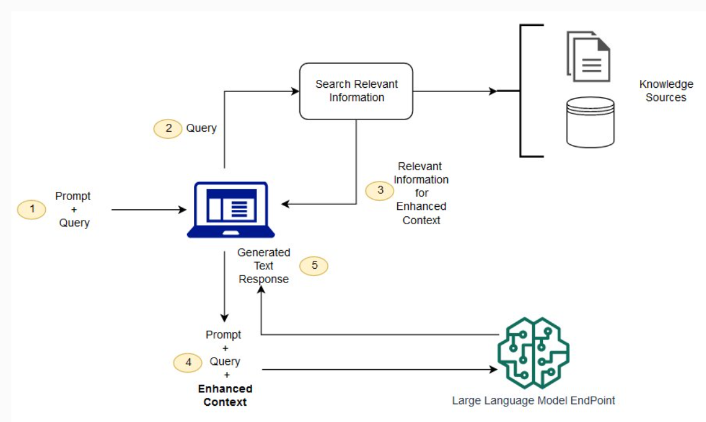

# Documentação RAG

# Introdução

## O que é?

Retrieval-Augmented Generation (RAG) é uma técnica que melhora a performance de grandes modelos de linguagem (LLMs) ao permitir que eles acessem uma base de conhecimento externa e confiável antes de gerar uma resposta. Isso expande as capacidades dos LLMs, que já são treinados em grandes volumes de dados, sem a necessidade de retreinamento. Essa abordagem é econômica e útil para manter as respostas precisas e relevantes em contextos específicos, como no uso de bases de conhecimento internas de uma organização.

## Quais são os benefícios?

- **Implementação econômica:** RAG evita os altos custos de treinar modelos com dados específicos de uma organização, permitindo incorporar informações novas de maneira mais acessível.

- **Informações atualizadas:** Facilita a conexão com fontes de dados em tempo real, garantindo que o LLM forneça informações recentes e relevantes.

- **Maior confiança dos usuários:** Com a possibilidade de atribuir fontes confiáveis às respostas, RAG aumenta a credibilidade das soluções de IA, permitindo que usuários consultem os documentos de origem.

- **Maior controle no desenvolvimento:** A equipe pode gerenciar as fontes de informação e restringir acessos, ajustando o LLM para diferentes necessidades e garantindo a correção de respostas.

## Arquitetura

# Aplicação no projeto

O RAG permite com que o modelo de liguagem utilizado no projeto, o LLaMA 3.1 8B, consiga manter os interesses e valores da empresa, além de aprender processos internos da Brastel e como responder os clientes da forma desejada pelos padrões de qualidade da empresa.

Como fonte externa de dados utilizada para passar para a LLM temos um registro histórico de perguntas e respostas já feitas em um momento passsado nos serviços de atendimento ao cliente da Brastel, além de um FAQ contendo várias informações de como proceder em casos genéricos, como por exemplo em que aba do aplicativo o cliente deve acessar para resolver problemas de remessa.

# Referências

O que é geração aumentada de recuperação (RAG)? – Explicação sobre a RAG – AWS. Disponível em: <https://aws.amazon.com/pt/what-is/retrieval-augmented-generation/>.